<!-- omit in toc -->
# Guia de Instalação e Configuração do SimpleSAMLphp como proxy SAML 
 
<!-- omit in toc -->
## 📑 Sumário
- [ℹ️ Sobre](#ℹ️-sobre)
- [📋 Pré-Requisitos](#-pré-requisitos)
  - [Ambiente](#ambiente)
  - [Do SimpleSAMLphp](#do-simplesamlphp)
- [🛠️ Instalação](#️-instalação)
  - [Servidor HTTP Apache](#servidor-http-apache)
  - [PHP](#php)
  - [SimpleSAMLphp (SSP)](#simplesamlphp-ssp)
- [🛠️ Configuração](#️-configuração)
  - [SimpleSAMLphp (SSP)](#simplesamlphp-ssp-1)
    - [No apache](#no-apache)
      - [Permissões](#permissões)
      - [Configurações do site](#configurações-do-site)
      - [Testar instalação](#testar-instalação)
    - [Configuração do SSP](#configuração-do-ssp)
      - [Configuração geral](#configuração-geral)
    - [SAML SP](#saml-sp)
      - [Gerar certificado](#gerar-certificado)
      - [Propriedades do SP](#propriedades-do-sp)
      - [Gerar metadata](#gerar-metadata)
    - [SAML IdP](#saml-idp)
      - [Habilitar IdP](#habilitar-idp)
      - [Gerar metadata](#gerar-metadata-1)
    - [Relação de confiança](#relação-de-confiança)
      - [Metadados da federação](#metadados-da-federação)
        - [Habilitar módulos](#habilitar-módulos)
        - [Configurar módulos](#configurar-módulos)
        - [Configurar tarefa no Cron](#configurar-tarefa-no-cron)
        - [Testar autenticação com a federação](#testar-autenticação-com-a-federação)
      - [Metadado do Provedor de Serviço](#metadado-do-provedor-de-serviço)
        - [Inserir metadado do SP no IdP do Proxy](#inserir-metadado-do-sp-no-idp-do-proxy)
        - [Autenticação no provedor de serviço](#autenticação-no-provedor-de-serviço)


## ℹ️ Sobre

O simpleSAMLphp (SSP) é uma solução para autenticação com foco em oferecer suporte para o padrão SAML 2.0. É um projeto liderado pela [UNINETT](https://www.uninett.no/) e com um conjunto de colaboradores externos bastante ativos. O SSP é desenvolvido em PHP e possibilita a configuração para funcionar tanto como um Provedor de Serviços (SP) quanto como um Provedor de Identidades (IdP). Apesar de ter o foco no SAML, suporta outros protocolos e frameworks conhecidos, como Shibboleth 1.3, CAS, OpenID, WS-Federation ou OAuth e pode ser facilmente extensível por sua estrutura ser baseada em módulos.

Além de atuar como SP ou IdP, o SimpleSAMLphp possui alguns recursos avançados que podem ser configurados. Um desses recursos é a funcionalidade de atuar como um Proxy SAML (IdP/SP), que pode ser entendido como uma ponte entre SPs e IdPs, conforme apresentado na Figura 1. Para essa opção, a configuração é feita utilizando o IdP e o SP conectados juntos. Esse documento descreve como instalar o SSP e configurá-lo para utilizar como IdP *Proxy* (*Proxy* SAML).

<p align="center">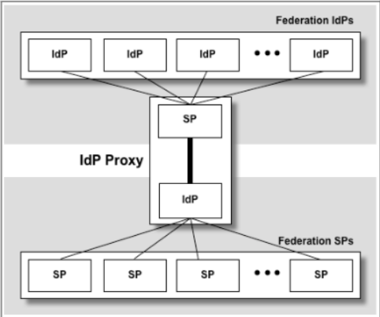</p>
 
## 📋 Pré-Requisitos

### Ambiente

- Servidor com IP ou FQDN válido;
  - RAM: 4 GB
  - HD: 10 GB
- Usuário com permissão de sudo;
- Chave e Certificado TLS do domínio.

### Do SimpleSAMLphp

- Web Server capaz de executar scripts PHP;
  - Para esse guia foi escolhido o Apache HTTP.
- PHP versão maior ou igual à versão 7.1;
  - Neste guia será instalado o PHP 8.1.
- Suporte às seguintes extensões PHP;
  - date, dom, hash, libxml, openssl, pcre, SPL, zlib, json, mbstring.
  - curl, session (PHP session handler), memcache.

- Certifique-se de instalar o composer para instalação das dependências do composer.json.

## 🛠️ Instalação

### Servidor HTTP Apache

A seguir estão descritos os processos de instalação do Apache no Ubuntu (**apache2**).

1. Atualize os pacotes com comando a seguir.

   `sudo apt-get update`

2. Após o término da atualização faça a instalação do apache2 executando o seguinte comando:

   `sudo apt-get install apache2`

3. No Ubuntu o serviço inicia automaticamente. Verifique o status executando.

   `sudo systemctl status apache2`

   <p align="center">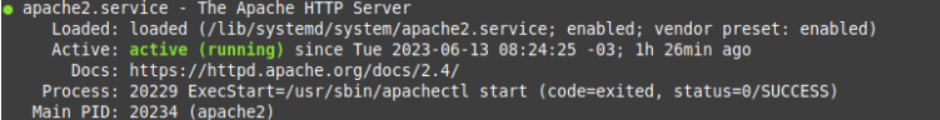</p>

### PHP

A seguir estão descritos os processos de instalação do PHP no Ubuntu.

1. Instale o php com o comando a seguir.

   `sudo apt-get install -y php libapache2-mod-php`

2. Algumas extensões já são instaladas por padrão. Instale as demais executando.

   `sudo apt-get install -y php-xml php-mbstring php-curl php-memcache`

3. Após instalar as extensões execute o comando a seguir para reiniciar o Apache.

   `sudo service apache2 restart`

   Verifique a instalação das seguintes dependências:

   - php-xml
   - php-curl
   - libapache2- mod- mod-php8.0

### SimpleSAMLphp (SSP)

1. Faça o download da versão mais recente do SSP com o comando:

   `curl -sL https://github.com/simplesamlphp/simplesamlphp/releases/download/v2.0.3/simplesamlphp-2.0.3.tar.gz -o simplesaml.tar.gz`2

2. Extraia o arquivo com o comando:

   `tar zxf simplesaml.tar.gz`

3. Copie os arquivos extraídos para o diretório **/var** do servidor por meio do seguinte comando:

   `sudo cp -a simplesamlphp /var/simplesamlphp/`

## 🛠️ Configuração

### SimpleSAMLphp (SSP)

#### No apache

##### Permissões

1. Altere o dono dos arquivos dentro do subdiretório **www**.

   `sudo chown -R www-data /var/simplesamlphp/public`

##### Configurações do site

1. Abra o arquivo de configuração do site padrão para o TLS com um editor de texto (os exemplos a seguir utilizam o editor vim).

   `sudo vim /etc/apache2/sites-available/default-ssl.conf`

2. Edite o arquivo modificando ou inserindo o conteúdo dentro do elemento **<VirtualHost _default_:443>** conforme exemplo apresentado a seguir.

Altere os itens destacados de acordo com as suas configurações:

- **service.example.com**: para o FQDN ou IP do servidor.
- **/etc/pki/tls/certs/localhost.crt**: para o caminho do certificado TLS.

**/etc/pki/tls/private/localhost.key**: para o caminho da chave privada TLS.

```bash
<VirtualHost _default_:443>
        ServerName service.example.com
        DocumentRoot /var/simplesamlphp/public
 
        SetEnv SIMPLESAMLPHP_CONFIG_DIR /var/simplesamlphp/config
 
        Alias /simplesaml /var/simplesamlphp/public
 
        <Directory /var/simplesamlphp/public>
             Require all granted
        </Directory>
   
        SSLCertificateFile /etc/pki/tls/certs/localhost.crt
        SSLCertificateKeyFile /etc/pki/tls/private/localhost.key

</VirtualHost>

```

3. Configurar redirecionamento https. O redirecionamento é configurado editando o arquivo **/etc/apache2/sites-available/default-ssl.conf**:

   `sudo vim /etc/apache2/sites-available/default-ssl.conf`

   Dentro do elemento **<IfModule mod_ssl.c>** insira um novo elemento chamado **<VirtualHost \*:80>** com o conteúdo apresentado a seguir. Altere **service.example.com** para o FQDN ou IP do servidor e salve as alterações.

   ```
   <VirtualHost *:80>
          ServerName service.example.com
   
          # Redirect Requests to SSL
          Redirect permanent / https://service.example.com
   
          ErrorLog ${APACHE_LOG_DIR}/error.log
          CustomLog ${APACHE_LOG_DIR}/access.log combined
   </VirtualHost>
   ```

   Execute os seguintes comandos para efetivar as alterações:

   `sudo a2dissite 000-default.conf`

   `sudo a2enmod ssl`

   `sudo a2ensite default-ssl.conf`

**Nota**

> [!NOTE]
>
> Para verificar se há algum erro de sintaxe nas configurações realizadas execute o seguinte comando. Esta ação é opcional.

`sudo apachectl configtest`

Em caso de sucesso será apresentada a mensagem de Syntax OK.

4. Reinicie o servidor Apache com o comando:

   `sudo systemctl restart apache2`

##### Testar instalação

Acesse o serviço via navegador através da URL https://**service.example.com**, substituindo o FQDN pelo do servidor utilizado.
<p align="center">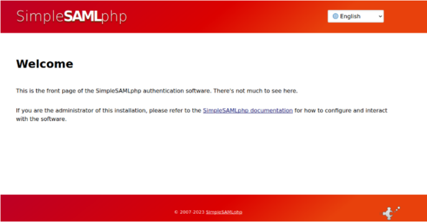</p>

#### Configuração do SSP

##### Configuração geral

1. Gere o arquivo .php a partir do arquivo .dist em **/var/simplesamlphp/config/config.php.dist** com:

   `sudo cp /var/simplesamlphp/config/config.php.dist /var/simplesamlphp/config/config.php`

2. Edite o arquivo localizado em **/var/simplesamlphp/config/config.php**.

   `sudo vim /var/simplesamlphp/config/config.php`

   Altere as seguintes propriedades para as suas configurações:

   > [!NOTE]
   >
   > Todos os nomes das propriedades alteradas ou inseridas, bem como os respectivos valores do tipo *string*, devem estar entre aspas simples.

   - **baseurlpath**: URL do servidor. 

   (e.g., ‘https://service.example.com/simplesaml’)

   - **technicalcontact_name**: nome de um contato técnico.

   - **technicalcontact_email**: e-mail do contato técnico.

   - **timezone**: timezone do ambiente. (e.g., ‘America/Sao_Paulo’)

   - **language.default**: verificar em language.available possíveis opções.

   - **session.cookie.secure**: habilitar para enviar atributo Secure no cabeçalho Set-Cookie (recomendado para acesso somente via https). (e.g., true)

   - **secretsalt**: uma string de salto secreto que o SSP utiliza para gerar hashes seguras. A string pode ser gerada com o seguinte comando.

     `LC_CTYPE=C tr -c -d '0123456789abcdefghijklmnopqrstuvwxyz' </dev/urandom | dd bs=32 count=1 2>/dev/null;echo`

   - **auth.adminpassword**: senha para acessar a página de instalação e administração do SSP. É recomendado gerar uma *hash* da senha e inseri-la no arquivo, para este fim deve ser utilizado o módulo **pwgen.php** por meio do comando:

     `sudo /var/simplesamlphp/bin/pwgen.php`

   3. Realize o teste das configurações efetuadas no item anterior executando os seguintes passos:
      1. Acesse a página de instalação do SSP via navegador através da URL https://service.example.com/admin, substituindo o FQDN pelo do servidor utilizado. Digite as credenciais de admin
      2. Clique em Test.
      <p align="center">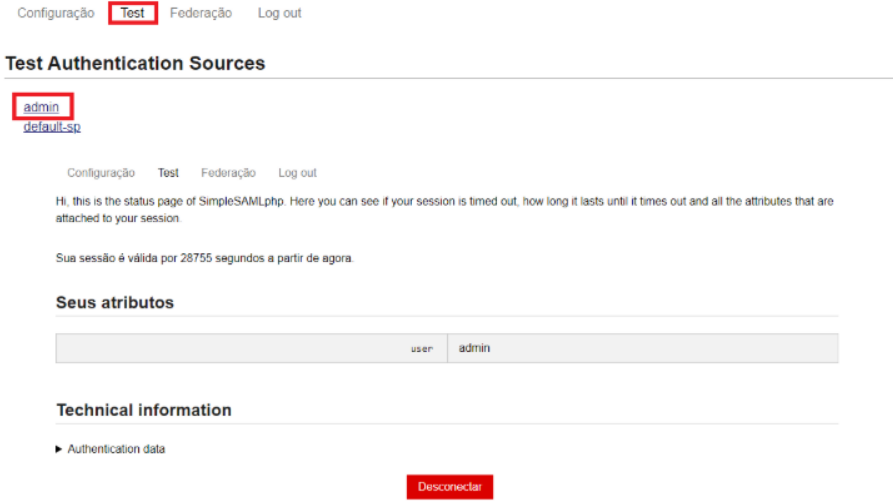</p>

> [!NOTE]
>
> A possibilidade de utilizar fontes de autenticação é o que permite a funcionalidade de proxy SAML. Para isso, o IdP é configurado para utilizar o SP SAML (default-sp) como fonte de autenticação. O SP, por sua vez, é configurado para autenticação com outro IdP ou uma federação. As próximas subseções descrevem as configurações necessárias para habilitar essa funcionalidade. 

#### SAML SP

O SP do SimpleSAMLphp é configurado como uma fonte de autenticação. As fontes de autenticação são incluídas no arquivo **authsources.php**. Esta seção descreve as informações mínimas e necessárias para configurar o SP com o objetivo de utilizar a solução SP/IdP como proxy SAML.

##### Gerar certificado

Será necessário um certificado para assinar e encriptar (se configurado) as asserções que serão trocadas entre as entidades. 

1. Para criar um certificado autoassinado execute o comando:

   `sudo openssl req -newkey rsa:2048 -new -x509 -days 3652 -nodes -out sp-cert.crt -keyout sp-key.pem`

2. Mova os arquivos **sp-key.pem** e **sp-cert.crt** para o diretório de certificados do SSP com o seguinte comando:

   `sudo mv sp-cert.crt sp-key.pem /var/simplesamlphp/cert/`

3. Altere o dono dos arquivos de certificado e chave dentro do diretório **/var/simplesamlphp/cert/**

   `sudo chown -R www-data /var/simplesamlphp/cert/`

##### Propriedades do SP

1. Gere o arquivo .php a partir do arquivo .dist em **/var/simplesamlphp/config/authsources.php.dist** com:

   `sudo cp /var/simplesamlphp/config/authsources.php.dist /var/simplesamlphp/config/authsources.php`

2. Edite o arquivo **/var/simplesamlphp/config/authsources.php**.

   `sudo vim /var/simplesamlphp/config/authsources.php`

   Altere ou insira as seguintes propriedades na fonte de autenticação **default-sp** para as informações de seu ambiente.

   > [!NOTE]
   >
   > **Nota -** Todos os nomes das propriedades alteradas ou inseridas, bem como os respectivos valores do tipo *string*, devem estar entre aspas simples.

   - **entityID**: identificador do SP SAML. Se definido como null, o **entityID** será gerado com base na URL do metadado. (e.g., ‘https://service.example.com/sp/simplesamlphp’) ;
   - **privatekey**: arquivo da chave privada gerado na subseção anterior. (e.g., ‘sp-key.pem’);
   - **certificate**: arquivo do certificado gerado na subseção anterior. (e.g., ‘sp-cert.cert’);
   - **assertion.encryption**: habilitar criptografia da asserção (recomendado). (e.g., true);
   - **nameid.encryption**: criptografar o atributo **nameID** (recomendado). (e.g., true);
   - **idp**: idp que deverá ser utilizado para autenticação do SP. Se definido como null, uma lista com IdPs disponíveis é apresentada. Neste guia será utilizado a configuração de um DS (*Discovery Service*), portanto essa opção será mantida como null;
   - **discoURL**: URL do Serviço de descoberta (DS). Se definido como null, um EDS (*Embedded Discovery Service*) será apresentado com os IdPs configurados e disponíveis. (e.g., 'https://DS.example.com/WAYF.php').

   O quadro seguinte contém um exemplo de uma configuração da fonte **default-sp**:

   ```
   'default-sp' => [
       	'saml:SP',
   
       	'entityID' => ‘https://service.example.com/sp/simplesamlphp’,
   
       	'privatekey' => 'sp-key.pem',
       	'certificate' => 'sp-cert.crt',
   
       	'assertion.encryption' => true,
       	'nameid.encryption' => true,
   
       	'idp' => null,
   
       	'discoURL' => 'https://DS.example.com/WAYF.php',
   	],
   ```

##### Gerar metadata

Com as configurações realizadas, já é possível fazer o download do metadado do SAML SP.

1. Para este fim, acesse via navegador a seguinte URL (alterando o FQDN):

   `https://FQDN/simplesaml/module.php/saml/sp/metadata.php/default-sp`

   > [!NOTE]
   >
   > **Nota -** Após o download do metadado do SP, é necessário enviá-lo para o operador da Federação para concluir a relação de confiança.

#### SAML IdP

O IdP SimpleSAMLphp é configurado nos arquivos com sufixo ***-idp-hosted.php** dentro do diretório de metadados de acordo com o protocolo utilizado (Shibboleth 1.3, SAML 2.0 ou WSFed). Porém, é necessário habilitar a função de IdP nas configurações globais. Nesta seção são apresentadas as configurações mínimas e necessárias para o IdP operar na solução como proxy SAML.

##### Habilitar IdP

Habilite a função de IdP de acordo com o protocolo utilizado executando a seguinte etapa:

1. Edite o arquivo **/var/simplesamlphp/config/config.php**

   `sudo vim /var/simplesamlphp/config/config.php`

2. Edite o arquivo **/var/simplesamlphp/metadata/saml20-idp-hosted.php**.

   `sudo vim /var/simplesamlphp/metadata/saml20-idp-hosted.php`

   Altere ou insira as seguintes propriedades no arquivo adequadas para as informações de seu ambiente.

   > [!NOTE]
   >
   > **Nota -** Todos os nomes das propriedades alteradas ou inseridas, bem como os respectivos valores do tipo *string*, devem estar entre aspas simples.

   - **privatekey**: arquivo da chave privada do IdP. (e.g., ‘sp-key.pem’)
   - **certificate**: arquivo do certificado gerado para o IdP. (e.g., ‘sp-cert.crt’)

   > [!NOTE]
   >
   > Os certificados podem ser gerados conforme explicado. Para testes serão utilizados os mesmos arquivos gerados para o SP.

   - **auth**: fonte de autenticação escolhida para o IdP. Neste guia, o objetivo é utilizar a funcionalidade de *proxy*, portanto a fonte de autenticação será a ‘default-sp’ configurada anteriormente.

     > [!NOTE]
     >
     > **Nota -** É a propriedade **auth** que possibilita a utilização do SimpleSAMLphp como um *proxy* SAML. Ou seja, configura-se a fonte de autenticação do IdP como sendo o SP. E o SP é configurado para utilizar o perfil *Web Browser* SSO do SAML para autenticação.

   - **assertion****.****encryption**: habilitar criptografia da asserção (recomendado para relação de confiança com SP Shibboleth). (e.g., true)
   - **attributes****.****NameFormat**: habilitar a liberação de atributos no formato específico para interoperabilidade entre entidades do SAML 2.0 (recomendado) 

   (e.g., ‘urn:oasis:names:tc:SAML:2.0:attrname-format:uri’)

   - **authproc**: descomente para habilitar a conversão dos nomes de atributo para o formato OID.

     > [!NOTE]
     >
     > **Nota -** Será no formato da conversão configurada em **authproc** que os atributos estarão disponíveis na asserção enviada para o SP.

Segue um exemplo do conteúdo do arquivo **saml20-idp-hosted.php**.

```
$metadata['__DYNAMIC:1__'] = [

 'host' => '__DEFAULT__',
	
 'privatekey' => 'sp-key.pem',
 'certificate' => 'sp-cert.crt',

 'auth' => 'default-sp',

 'assertion.encryption' => true,

 'attributes.NameFormat' =>   'urn:oasis:names:tc:SAML:2.0:attrname-format:uri',
 'authproc' => [
    	// Convert LDAP names to oids.
    	100 => ['class' => 'core:AttributeMap', 'name2oid'],
	],
];
```

##### Gerar metadata

Com as configurações realizadas na subseção anterior, já é possível fazer o download do metadado do SAML IdP. 

1. Para este fim, acesse via navegador a seguinte URL (alterando o FQDN):

   `https://FQDN/saml2/idp/metadata.php`

> [!NOTE]
>
> **Nota -** Após o download do metadado, é necessário enviá-lo para o operador do Provedor de Serviço para concluir a relação de confiança

#### Relação de confiança

Em termos técnicos a relação de confiança no SAML é feita com a troca de metadados entre as entidades (SP e IdP) participantes do processo de autenticação. O metadado é um arquivo no formato xml que descreve todas as características dessas entidades. Nesse contexto, é possível considerar dois tipos de relação de confiança:

- **1 para 1**: a relação de confiança é estabelecida entre um SP e um IdP, ou seja, os metadados são trocados apenas entre as duas entidades.
- **1 para muitos**: a relação de confiança é efetuada entre um SP e todos os IdPs de uma federação ou entre um IdP e todos os SPs.

Esta seção apresenta as etapas necessárias para concluir os dois casos de relação de confiança, tendo em vista que o SimpleSAMLphp foi configurado como um *proxy* SAML para integrar provedores de serviço sem a capacidade de efetuar a relação de confiança com toda uma federação. Será demonstrado como efetuar a relação de confiança entre o SAML SP do *proxy* e a federação (relação 1 para muitos), utilizando o módulo **Metarefresh** que permite a atualização de forma automática e periódica dos metadados da federação,  e também a relação de confiança entre o SAML IdP do *proxy* e provedor de serviço (relação 1 para 1).

##### Metadados da federação

Uma federação SAML pode ser definida como uma entidade agregadora de todos os metadados das entidades participantes em um único arquivo xml. Para um SP ou IdP fazer parte desta federação é necessário que, após realizado o processo de adesão, seu metadado seja enviado para o operador incluí-lo nesse arquivo. Além disso, é necessário que esse arquivo seja atualizado de forma periódica (no SP ou IdP) para interoperabilidade com novos participantes. 

A relação de confiança entre o SAML SP *proxy* e a federação é efetuada em duas etapas:

1. Enviar o arquivo ou o *link* do metadado do SP para o operador da federação. O *download* pode ser efetuado através do seguinte link (alterando o FQDN):

   `https://FQDN/simplesaml/module.php/saml/sp/metadata.php/default-sp`

2. Fazer o *download* do arquivo de metadados da federação, no *link* que será disponibilizado pelo operador, e configurar no SP SAML do *proxy*. O *download* pode ser feito de forma manual, mas será apresentado como utilizar o módulo **Metarefresh** (em conjunto com o módulo **Cron**) para automatizar a etapa.

###### Habilitar módulos

Os módulos no SimpleSAMLphp estão disponíveis em **/var/simplesamlphp/modules** e para habilitá-los basta criar um arquivo vazio com o nome **enable** no seu respectivo diretório.

1. Adicione a dependência “simplesamlphp-module-metarefresh” com:

   `composer require simplesamlphp/simplesamlphp-module-metarefresh`

2. Para habilitar os módulos **cron** e **metarefresh** altere o arquivo **/var/simplesamlphp/config.php** com:

   ```
   module.enable' => [
       	[...]
       	'cron' => true,
       	'metarefresh' => true,
   	],
   ```

3. Execute o teste do módulo **metarefresh** para verificar seu funcionamento:

   `sudo /var/simplesamlphp/modules/metarefresh/bin/metarefresh.php -s https://ds.cafeexpresso.rnp.br/metadata/ds-metadata.xml`

   Em caso de sucesso será apresentado em tela as informações do arquivo de metadados.

###### Configurar módulos

1. Os arquivos de configuração para os módulos devem ser copiados para o diretório de configuração do SimpleSAMLphp (**/var/simplesamlphp/config**). O SSP possui arquivos templates das configurações nos diretórios do próprio módulo.

Copie o arquivo template de configuração do módulo **cron**:

`sudo cp /var/simplesamlphp/modules/metarefresh/config-templates/config-metarefresh.php /var/simplesamlphp/config/`

2. Edite o arquivo **/var/simplesamlphp/config/config-metarefresh.php**

`sudo vim /var/simplesamlphp/config/config-metarefresh.php`

Altere o exemplo contido no arquivo, modificando ou inserindo as seguintes propriedades para as informações de seu ambiente.

> [!NOTE]
>
> **Nota -** Todos os nomes das propriedades alteradas ou inseridas, bem como os respectivos valores do tipo *string*, devem estar entre aspas simples.

- **sets**: neste elemento podem ser adicionadas fontes de metadados. Escolha um nome para a fonte que será configurada (e.g., ‘federation’).
- **cron**: escolha a periodicidade de execução pelo crontab.
  - frequent: metadado será atualizado a cada minuto;
  - hourly: atualização a cada hora;
  - daily: atualização de uma vez por dia.
- **src**: informar URL para download do arquivo de metadados da federação

(e.g., ‘[https://DS.example.com/metadata/ds-metadata.xml](https://ds.example.com/metadata/ds-metadata.xml)’).

> [!NOTE]
>
> **Nota -** Caso o arquivo de metadados seja assinado é necessário configurar as seguintes propriedades: **certificates**, **validateFingerprint** e **validateFingerprintAlgorithm**. Não havendo necessidade basta comentar as linhas com essas propriedades.

- **expireAfter**: tempo em segundos que uma entrada de metadados será válida (limite máximo de 4 dias).

- **outputDir**: diretório no qual será armazenado o conjunto de arquivos dos metadados. Recomendado criar um subdiretório no diretório padrão de metadados (e.g., ‘metadata/metarefresh-dir’).

- **outputFormat**: formato de saída do arquivo (‘flatfile’ ou ‘serialize’).

- **types**: tipos de entidades que serão carregadas do arquivo de metadados da federação.

  - saml20-idp-remote: essa opção cria o arquivo com metadados dos IdPs da federação para o SAML 2.0.

  - saml20-sp-remote: cria o arquivo com os metadados dos SPs da federação para o SAML 2.0.

    > [!NOTE]
    >
    > **Nota -** Podem ser inseridos mais de um tipo separado por vírgula, mas como a configuração realizada neste item é para o SAML SP do *proxy*, basta incluir apenas os IdPs SAML (‘saml20-idp-remote’). Caso não seja informado nenhum tipo, serão criados arquivos para todos os tipos de entidades.

    

Segue um exemplo com conteúdo do arquivo **config-metarefresh.php**:

```
<?php

$config = [
 'sets' => [

   'federation' => [
     'cron' => ['hourly'],
     'sources' => [
      [
       'src' => 'https://DS.example.com/metadata/ds-metadata.xml',
       'template' => [
          'tags' => ['federation'],
          'authproc' => [
             51 => ['class' => 'core:AttributeMap', 'oid2name'],
          ],
        ],
      ],
     ],

     'expireAfter' => 60*60*24*4, // Maximum 4 days cache time (3600*24*4)
     'outputDir' => 'metadata/metarefresh-dir/',
     'outputFormat' => 'flatfile',
     'types' => ['saml20-idp-remote'],
    ],
  ],
];
```

3. Edite o arquivo **/var/simplesamlphp/config/config.php**.

`sudo vim /var/simplesamlphp/config/config.php`

Insira a fonte de metadados criada anteriormente na propriedade **metadata.sources** conforme exemplo:

```
'metadata.sources' => [
    	['type' => 'flatfile'],
    	['type' => 'flatfile', 'directory' => 'metadata/metarefresh-dir]
],
```

> [!NOTE]
>
> O tipo de arquivo e o nome do diretório devem ser os mesmos que os informados na etapa de configuração do arquivo **config-metarefresh.php.**

4. Edite o arquivo **/var/simplesamlphp/config/module_cron.php**:

`sudo vim /var/simplesamlphp/config/module_cron.php`

Altere a propriedade **key** para uma string aleatória. Essa string será usada como recurso de segurança para restringir o acesso ao cron. Segue um exemplo com conteúdo do arquivo:

```
<?php
$config = [
	'key' => 'secret_random_key',
	'allowed_tags' => ['daily', 'hourly', 'frequent'],
	'debug_message' => true,
	'sendemail' => true,
];
```

5. Crie o diretório para o arquivo de metadados e modifique permissão para leitura e escrita pelo usuário do Apache.

   1. Execute o comando abaixo para criar o diretório (altere **metarefresh-dir** para o diretório informado na configuração realizada)

      `sudo mkdir /var/simplesamlphp/metadata/**metarefresh-dir**/`

   2. Altere o dono do diretório e permissões para que o usuário do Apache possa ler e escrever.

      `sudo chown -R www-data /var/simplesamlphp/metadata/**metarefresh-dir**`

###### Configurar tarefa no Cron

É possível inserir tarefas no **Cron** por meio de HTTP ou CLI. Neste item será demonstrado como efetuar a configuração utilizando o método HTTP.

1. Acesse a página de admin do SSP via navegador através da URL **https://service.example.com/admin**, substituindo o FQDN pelo do servidor utilizado. Digite as credenciais.

2. Clique na aba Configuração e no link Cron module information page. 
<p align="center">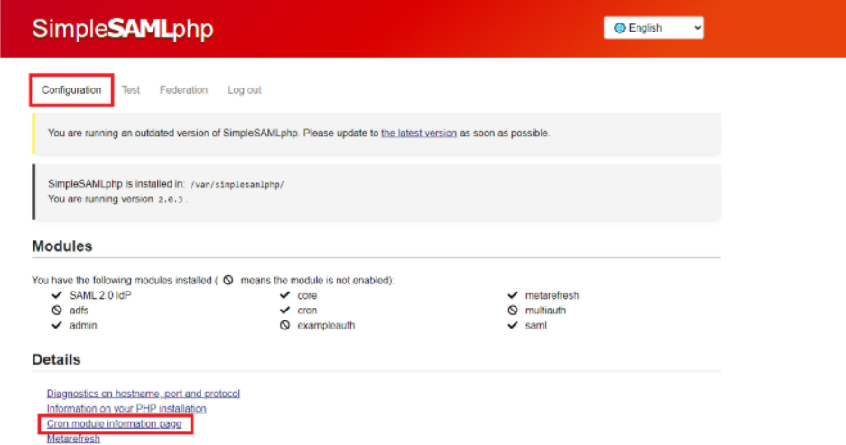</p>

3. Na página seguinte (resultados do Cron) copie a configuração do Cron de acordo com a periodicidade configurada no arquivo 
<p align="center">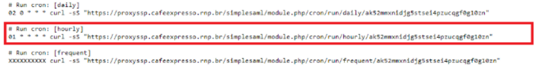</p>

**config-metarefresh.php**.

1. Adicione a configuração no crontab do usuário do Apache editando o arquivo com o seguinte comando:

   `sudo crontab -e -u www-data`

   Insira a configuração copiada.

2. Execute a tarefa agendada via navegador para efetuar o download do metadado uma primeira vez. Essa etapa é necessária quando a periodicidade for diferente de **frequent**.

   1. Ainda na página resultados do Cron e logado como administrador (etapas 1, 2 e 3) clique no link Executar cron [hourly].
   <p align="center">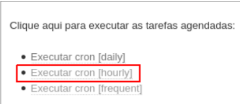</p>
   
###### Testar autenticação com a federação

Para testar se a relação de confiança entre o SAML SP do proxy e a federação foi realizada com sucesso é possível realizar a autenticação usando um IdP da federação. Para isso execute as seguintes etapas.

> [!NOTE]
>
> **Nota -** Certifique-se de que o metadado do SP foi inserido na federação pelo operador.

1. Acesse a página de admin do SSP via navegador através da URL **https://service.example.com/admin**, substituindo o FQDN pelo do servidor utilizado. Digite as credenciais.
2. Clique na aba test e escola a fonte de autenticação default-sp. 
   <p align="center">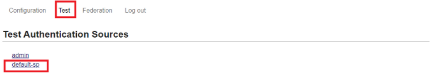</p>

3. O navegador será redirecionado para o serviço de descoberta (DS) ou um EDS, conforme configurado. Selecione a instituição que deseja se autenticar.
   <p align="center">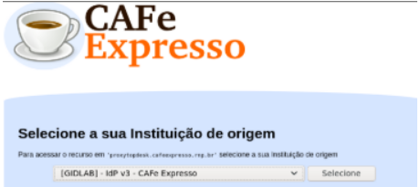</p>
4. Após a seleção da instituição, o navegador será redirecionado para a página de login do IdP. Informe as credenciais do usuário e clique no botão de Login.
   <p align="center">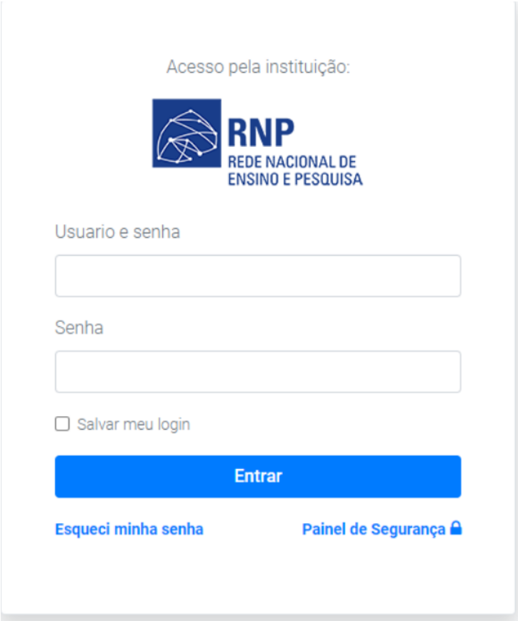</p>
5. Em alguns IdPs está configurado uma página chamada de tela de consentimento, em que são informados quais atributos estão sendo liberados para o SP. Clique para aceitar e o navegador será redirecionado para a página do SP Exemplo do SimpleSAMLphp.
   <p align="center">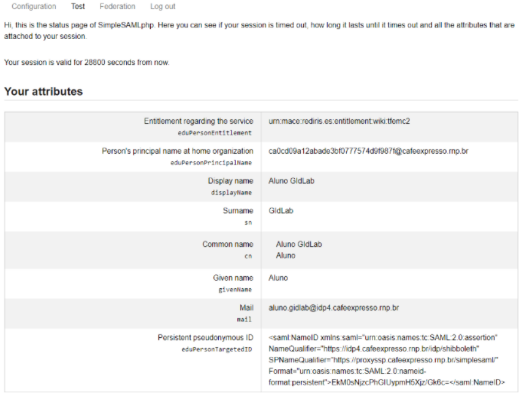</p>


##### Metadado do Provedor de Serviço

O teste de autenticação anterior foi realizado com o SP de Exemplo do SSP. Porém, o objetivo da utilização do *proxy* SAML, neste guia, é a integração de um ou mais provedores de serviço SAML que não tenham a capacidade de realizar uma relação de confiança com toda a federação (1 para muitos). Para os provedores de serviço com essa restrição é possível integrar-se à federação efetuando a relação de confiança com o SAML IdP do *proxy* (1 para 1). 

A relação de confiança entre o Provedor de Serviço SAML e o IdP do *proxy* é efetuada também em duas etapas:

1. Enviar o arquivo do metadado do IdP do *Proxy* para o operador do provedor de serviço. O arquivo xml está disponível através do seguinte link (alterando o FQDN).

   `https://**FQDN**/simplesaml/saml2/idp/metadata.php`

2. Solicitar o arquivo do metadado do provedor de serviço e inserir no IdP SAML do proxy. Caso seja possível realizar o *download* através de um *link*, também é possível utilizar o módulo **Metarefresh** para atualizar de forma automática. Neste guia será apresentado como inserir de forma manual.

###### Inserir metadado do SP no IdP do Proxy

> [!NOTE]
>
> **Nota -** Certifique-se de que o metadado do SP foi inserido na federação pelo operador.

Os metadados dos provedores de serviço que utilizarão o proxy para integração com a federação devem ser adicionados em **/var/simplesamlphp/metadata/saml20-sp-remote.php/**. O arquivo será fornecido em formato xml (padrão SAML) e será necessário convertê-lo para o formato de metadado do SimpleSAMLphp utilizando a ferramenta de conversão do próprio SSP. Para isso execute as seguintes etapas:

1. De posse do metadado do SP, acesse a página de admin do SSP via navegador através da URL **https://service.example.com/admin**, substituindo o FQDN pelo do servidor utilizado. Digite as credenciais.

2. Clique na aba Federação e no link Conversor de XML para metadata do SimpleSAMLphp.
   <p align="center">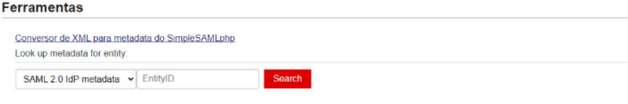</p>

4. Na página seguinte (Parser Metadata) carregue o arquivo XML clicando em or select a file ou inserindo o conteúdo do arquivo XML no espaço destinado. Clique no botão Parse.
   <p align="center">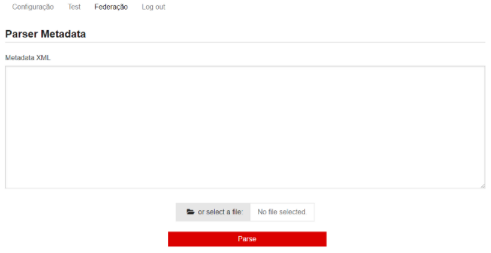</p>

5. A página será recarregada e apresentará o arquivo convertido para o formato de metadado do SimpleSAMLphp. Copie o conteúdo clicando no botão da área denominada "saml20-sp-remote".
   <p align="center">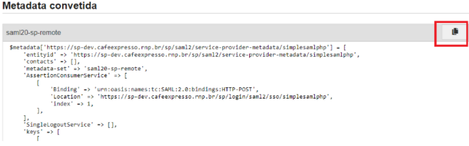</p>

6. Gere o arquivo php a partir do arquivo .dist em **/var/simplesamlphp/metadata/saml20-sp-remote.php.dist** com:

   `sudo cp /var/simplesamlphp/metadata/saml20-sp-remote.php.dist /var/simplesamlphp/metadata/saml20-sp-remote.php`

   Insira o conteúdo copiado na etapa 5 no final do arquivo e salve. 

###### Autenticação no provedor de serviço

Após a relação de confiança ser estabelecida é possível efetuar o teste de autenticação acessando a URL do provedor de serviço. Ao clicar no botão para login no serviço o navegador será redirecionado para o Serviço de descoberta da Federação e o processo continuará conforme apresentado.

O teste de autenticação consiste em verificar no provedor de serviço, a presença de um idp caracterizado como SimpleSAMLphp, este IDP realizará o redirecionamento para o serviço de descoberta.

   <p align="center">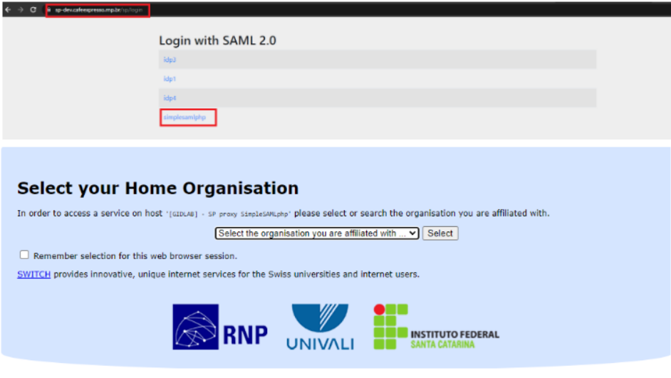</p>