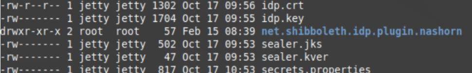

<!-- omit in toc -->
# Guia de Instalação IdP5
  Em setembro de 2023 foi lançada a versão 5 (cinco) do Shibboleth, que traz consigo atualizações de configurações e de dependências. Este guia de instalação tem como premissa detalhar as etapas necessárias para funcionamento dessa nova versão.  A abordagem recomendada para esse guia, é primeiro seguir o guia de instalação ofertado pelo Shibboleth disposto na seção “Links Importantes” e utilizar esse material aqui ofertado como facilitador de certas etapas no processo de configuração.
Quanto às dependências, abaixo são listadas as principais modificações para essa nova versão:
* Java 17
* Jetty 11+
* Tomcat 10+ (alternativa ao Jetty)
* Instalação feita em um ambiente Ubuntu 22.04

 Abaixo são ofertados links importantes utilizados durante o processo de configuração da ferramenta:
* [Guia de instalação Identity Provider 5](https://shibboleth.atlassian.net/wiki/spaces/IDP5/pages/3199500577/Installation)
* [Instalação do Amazon Corretto 17 for Linux — Distribuição gratuita, multiplataforma e pronta para produção do OpenJDK](https://docs.aws.amazon.com/corretto/latest/corretto-17-ug/generic-linux-install.html)

<!-- omit in toc -->
## 📚 Sumário 
- [LDAP](#ldap)
- [Instalação do Identity Provider](#instalação-do-identity-provider)
- [Configurações do Jetty](#configurações-do-jetty)
- [CONFIGURAÇÕES DO APACHE](#configurações-do-apache)
- [Possíveis problemas e soluções](#possíveis-problemas-e-soluções)


## LDAP
Para configuração da base LDAP, foram seguidos os passos descritos na [Wiki](https://ajuda.rnp.br/cafe/procedimentos-complementares/openldap/instalacao-do-openldap-com-esquema-breduperson-no-ubuntu-22.04). Para o presente caso, há necessidade de adaptação da seguinte diretiva:

```bash 
  sudo ldapadd -c -h localhost -W -x -D cn=admin,dc=meusite,dc=meudominio,dc=com,dc=br -f users.ldif 
```

Para o formato atualizado:

```bash 
  sudo ldapadd -c -h localhost -W -x -D cn=admin,dc=meusite,dc=meudominio,dc=com,dc=br -f users.ldif 
```

```bash 
  sudo ldapadd -c -W -x -D cn=admin,dc=meusite,dc=meudominio,dc=com,dc=br -f users.ldif
```


Também faz-se necessário a configuração das seguintes variáveis, lembre-se de exportá-las no sistema operacional:

```bash  
PERSISTENTDIDSALT=`openssl rand -base64 32` AFZUx9A2DpedVm1uyhk35yHudcI17CwsnGCb4gsZm2Y=  

COMPUTEDIDSALT=`openssl rand -base64 32` oz20CVu8yahlQRJ8vbHGnouHm4yGo4Mc50sM0cfV708=  

FTICKSSALT=`openssl rand -base64 32` e0zURmwrcbLiSP9ur+YRHULY57+t66kge9v7FJUu/js=
```

E a instalação da seguinte biblioteca:

  ```bash 
sudo apt install -y apache2 libapache2-mod-xforward
  ```

## Instalação do Identity Provider
Para instalação utilize este [link](https://shibboleth.net/downloads/identity-provider/latest5/). Após, rode o script valendo-se das seguintes diretivas:

```bash  
source /root/shibboleth-identity-provider-5.0.0/bin/install.sh \
    	-Didp.src.dir=/root/shibboleth-identity-provider-5.0.0 \
    	-Didp.target.dir=/opt/shibboleth-idp \
    	-Didp.sealer.password=changeit \
    	-Didp.keystore.password=changeit \
    	-Didp.conf.filemode=644 \
    	-Didp.host.name=FQDN \
    	-Didp.scope=cafeexpresso.rnp.br \
    	-Didp.entityID=https://FQDN/idp/shibboleth
```

 Gerando os certificados autoassinados:
  ```bash 
  cd /opt/shibboleth-idp/credentials/ 
  ```

  Remova arquivos previamente configurados:
  ```bash  
rm -f idp*
  ```
  Gere uma chave privada:
  ```bash  
openssl genrsa -out idp.key 2048
  ```
  Gere um certificado de chave pública:
  ```bash  
openssl req -batch -new -x509 -nodes -days 1095 -sha256 -key idp.key -set_serial 00 -config /tmp/openssl.cnf -out idp.crt
  ```

  Quanto aos arquivos estáticos ofertados pela CAFe, foram utilizados os direcionados ao  IdP v4.2.1. Para obtê-los:
  ```bash  
wget https://svn.cafe.rnp.br/repos/CAFe/idp-files-v421/conf/attribute-filter.xml -O /opt/shibboleth-idp/conf/attribute-filter.xml

wget https://svn.cafe.rnp.br/repos/CAFe/idp-files-v421/conf/attribute-resolver.xml -O /opt/shibboleth-idp/conf/attribute-resolver.xml

wget
https://svn.cafe.rnp.br/repos/CAFe/idp-files-v421/conf/metadata-providers.xml -O /opt/shibboleth-idp/conf/metadata-providers.xml

wget https://svn.cafe.rnp.br/repos/CAFe/idp-files-v421/conf/saml-nameid.xml -O /opt/shibboleth-idp/conf/saml-nameid.xml

wget https://svn.cafe.rnp.br/repos/CAFe/idp-files-v421/conf/admin/admin.properties -O /opt/shibboleth-idp/conf/admin/admin.properties

wget https://svn.cafe.rnp.br/repos/CAFe/idp-files-v421/conf/attributes/brEduPerson.xml -O /opt/shibboleth-idp/conf/attributes/brEduPerson.xml
wget

https://svn.cafe.rnp.br/repos/CAFe/idp-files-v421/conf/attributes/default-rules.xml -O /opt/shibboleth-idp/conf/attributes/default-rules.xml

wget
https://svn.cafe.rnp.br/repos/CAFe/idp-files-v421/conf/attributes/schac.xml -O /opt/shibboleth-idp/conf/attributes/schac.xml

wget https://svn.cafe.rnp.br/repos/CAFe/idp-files-v421/conf/attributes/custom/eduPersonTargetedID.properties -O /opt/shibboleth-idp/conf/attributes/custom/eduPersonTargetedID.properties
  ```

  Para o LDAP, as configurações utilizadas (em **/opt/shibboleth/conf/ldap.properties**) são:
  ```bash
  # LDAP authentication (and possibly attribute resolver) configuration
# Note, this doesn't apply to the use of JAAS authentication via LDAP

## Authenticator strategy, either anonSearchAuthenticator, bindSearchAuthenticator, directAuthenticator, adAuthenticator
idp.authn.LDAP.authenticator               	= bindSearchAuthenticator

## Connection properties ##
idp.authn.LDAP.ldapURL                      	= ldap://fqdn:389
idp.authn.LDAP.useStartTLS                 	= false
# Time to wait for startTLS responses
#idp.authn.LDAP.startTLSTimeout             	= PT3S
# Time to wait for connections to open
idp.authn.LDAP.connectTimeout              	= PT3S
# Time to wait for operation responses (e.g. search, bind)
idp.authn.LDAP.responseTimeout             	= PT3S
# Connection strategy to use when multiple URLs are supplied, either ACTIVE_PASSIVE, ROUND_ROBIN, RANDOM
#idp.authn.LDAP.connectionStrategy           	= ACTIVE_PASSIVE

## SSL configuration, either jvmTrust, certificateTrust, or keyStoreTrust
idp.authn.LDAP.sslConfig                   	= certificateTrust
## If using certificateTrust above, set to the trusted certificate's path
idp.authn.LDAP.trustCertificates            	= %{idp.home}/credentials/ldap-server.crt
## If using keyStoreTrust above, set to the truststore path
#idp.authn.LDAP.trustStore                   	= %{idp.home}/credentials/ldap-server.truststore

## Return attributes during authentication
#idp.authn.LDAP.returnAttributes             	= passwordExpirationTime,loginGraceRemaining
idp.authn.LDAP.returnAttributes             	= uid

## DN resolution properties ##

# Search DN resolution, used by anonSearchAuthenticator, bindSearchAuthenticator
# for AD: CN=Users,DC=example,DC=org
idp.authn.LDAP.baseDN                       	= dc=meusite,dc=meudominio,dc=com,dc=br
idp.authn.LDAP.subtreeSearch                	= true
idp.authn.LDAP.userFilter                   	= (uid={user})
# bind search configuration
# for AD: idp.authn.LDAP.bindDN=adminuser@domain.com
idp.authn.LDAP.bindDN                       	= cn=admin,dc=idp,dc=dominio,dc=com,dc=br

# Format DN resolution, used by directAuthenticator, adAuthenticator
# for AD use idp.authn.LDAP.dnFormat=%s@domain.com
idp.authn.LDAP.dnFormat                     	= uid=%s,dc=idp,dc=dominio,dc=com,dc=br

# pool passivator, either none, bind or anonymousBind
#idp.authn.LDAP.bindPoolPassivator              	= none

# LDAP attribute configuration, see attribute-resolver.xml
# Note, this likely won't apply to the use of legacy V2 resolver configurations
idp.attribute.resolver.LDAP.ldapURL         	= %{idp.authn.LDAP.ldapURL}
idp.attribute.resolver.LDAP.connectTimeout  	= %{idp.authn.LDAP.connectTimeout:PT3S}
idp.attribute.resolver.LDAP.responseTimeout 	= %{idp.authn.LDAP.responseTimeout:PT3S}
idp.attribute.resolver.LDAP.connectionStrategy  = %{idp.authn.LDAP.connectionStrategy:ACTIVE_PASSIVE}
idp.attribute.resolver.LDAP.baseDN          	= %{idp.authn.LDAP.baseDN:undefined}
idp.attribute.resolver.LDAP.bindDN          	= %{idp.authn.LDAP.bindDN:undefined}
idp.attribute.resolver.LDAP.useStartTLS     	= %{idp.authn.LDAP.useStartTLS:true}
idp.attribute.resolver.LDAP.startTLSTimeout 	= %{idp.authn.LDAP.startTLSTimeout:PT3S}
idp.attribute.resolver.LDAP.trustCertificates   = %{idp.authn.LDAP.trustCertificates:undefined}
idp.attribute.resolver.LDAP.searchFilter    	= (uid=$resolutionContext.principal)

# LDAP pool configuration, used for both authn and DN resolution
#idp.pool.LDAP.minSize                      	= 3
#idp.pool.LDAP.maxSize                      	= 10
#idp.pool.LDAP.validateOnCheckout           	= false
#idp.pool.LDAP.validatePeriodically         	= true
#idp.pool.LDAP.validatePeriod               	= PT5M
#idp.pool.LDAP.validateDN                   	=
#idp.pool.LDAP.validateFilter               	= (objectClass=*)
#idp.pool.LDAP.prunePeriod                  	= PT5M
#idp.pool.LDAP.idleTime                     	= PT10M
#idp.pool.LDAP.blockWaitTime
  ```
  Também foram feitas alterações em **/credentials/secrets.properties**, no qual foram acrescentadas as seguintes diretivas:
  ```bash
  #senha acesso ao serviço LDAP
idp.authn.LDAP.bindDNCredential = ${LDAPPWD}

#salts gerados na etapa de x509 iniciais.
idp.persistentId.salt  = ${PERSISTENTDIDSALT}

idp.cafe.computedIDsalt = ${COMPUTEDIDSALT}
  ```

  Em relação às configurações em **opt/shibboleth-idp/conf/idp.properties**, abaixo são relatadas as principais alterações efetuadas:
  ```bash
  idp.searchForProperties=true

idp.additionalProperties=/credentials/secrets.properties

idp.entityID=https://FQDN/idp/shibboleth

# Set the scope used in the attribute resolver for scoped attributes
idp.scope=dev.cafeexpresso.rnp.br

# Enable cross-site request forgery mitigation for views.
idp.csrf.enabled=true

# Settings for internal AES encryption key
idp.sealer.storeResource=%{idp.home}/credentials/sealer.jks
idp.sealer.versionResource=%{idp.home}/credentials/sealer.kver

# Settings for public/private signing and encryption key(s):
#  During decryption key rollover, point the ".2" properties at a second
#  keypair, uncomment in credentials.xml, then publish it in your metadata.
idp.signing.key=%{idp.home}/credentials/idp.key
idp.signing.cert=%{idp.home}/credentials/idp.crt
idp.encryption.key=%{idp.home}/credentials/idp.key
idp.encryption.cert=%{idp.home}/credentials/idp.crt

# The new install default for encryption is now AES-GCM.
idp.encryption.config=shibboleth.EncryptionConfiguration.GCM

# Configures trust evaluation of keys used by services at runtime
# Internal default is Chaining, overriden for new installs
idp.trust.signatures=shibboleth.ExplicitKeySignatureTrustEngine

# Configuration of client- and server-side storage plugins
idp.storage.htmlLocalStorage=true

# Track information about SPs logged into
idp.session.trackSPSessions=true
# Support lookup by SP for SAML logout
idp.session.secondaryServiceIndex=true

# Picks outbound bindings more sensibly than based on metadata order
idp.bindings.inMetadataOrder=false

# Comma-delimited languages to use if not match can be found with the
# browser-supported languages, defaults to an empty list.
idp.ui.fallbackLanguages=pt-br,en

# F-TICKS auditing - set a salt to include hashed username
idp.fticks.federation = CAFE
idp.fticks.algorithm = SHA-256
idp.fticks.salt = e0zURmwrcbLiSP9ur+YRHULY57+t66kge9v7FJUu/js=
idp.fticks.loghost= localhost
idp.fticks.logport= 514


# Set false if you want SAML bindings "spelled out" in audit log
idp.audit.shortenBindings=true

  ```
  Adicionalmente, foi acrescentada a seguinte diretiva em **/conf/saml-nameid.properties**:
  ```bash
  idp.persistentId.sourceAttribute = uid
  ```
  Adiante, para as configurações associadas ao metadado do IdP, abaixo é descrito o arquivo “idp-metadata.xml” criado em /opt/shibboleth-idp/metadata **(palavras descritas em caixa alta devem ser configuradas manualmente):**
  ```xml
  <?xml version="1.0" encoding="UTF-8"?>
 
<?xml version="1.0" encoding="UTF-8"?>
 
<EntityDescriptor  xmlns="urn:oasis:names:tc:SAML:2.0:metadata" xmlns:ds="http://www.w3.org/2000/09/xmldsig#" xmlns:shibmd="urn:mace:shibboleth:metadata:1.0" xmlns:xml="http://www.w3.org/XML/1998/namespace" xmlns:mdui="urn:oasis:names:tc:SAML:metadata:ui" entityID="https://${HN}.${HN_DOMAIN}/idp/shibboleth">
 
    	<IDPSSODescriptor protocolSupportEnumeration="urn:oasis:names:tc:SAML:2.0:protocol urn:oasis:names:tc:SAML:1.1:protocol urn:mace:shibboleth:1.0">
 
            	<Extensions>
                    	<shibmd:Scope regexp="false">${DOMAIN}</shibmd:Scope>
 
                    	<mdui:UIInfo>
                            	<mdui:OrganizationName xml:lang="en">${INITIALS} - ${ORGANIZATION}</mdui:OrganizationName>
                            	<mdui:DisplayName xml:lang="en">${INITIALS} - ${ORGANIZATION}</mdui:DisplayName>
                            	<mdui:OrganizationURL xml:lang="en">http://www.${DOMAIN}/</mdui:OrganizationURL>
                    	</mdui:UIInfo>
 
                    	<!--
                    	<md:ContactPerson contactType="technical">
                            	<md:SurName>${CONTACT}</md:SurName>
                            	<md:EmailAddress>${CONTACTMAIL}</md:EmailAddress>
                    	</md:ContactPerson>
                    	-->
            	</Extensions>
 
            	<KeyDescriptor>
                    	<ds:KeyInfo>
                            	<ds:X509Data>
                                    	<ds:X509Certificate>
${CRT}
                                    	</ds:X509Certificate>
                                    	</ds:X509Data>
                            	</ds:KeyInfo>
            	</KeyDescriptor>
 
            	<ArtifactResolutionService Binding="urn:oasis:names:tc:SAML:1.0:bindings:SOAP-binding" Location="https://${HN}.${HN_DOMAIN}:8443/idp/profile/SAML1/SOAP/ArtifactResolution" index="1"/>
            	<ArtifactResolutionService Binding="urn:oasis:names:tc:SAML:2.0:bindings:SOAP" Location="https://${HN}.${HN_DOMAIN}:8443/idp/profile/SAML2/SOAP/ArtifactResolution" index="2"/>
            	<!--
            	<SingleLogoutService Binding="urn:oasis:names:tc:SAML:2.0:bindings:HTTP-Redirect" Location="https://${HN}.${HN_DOMAIN}/idp/profile/SAML2/Redirect/SLO"/>
            	<SingleLogoutService Binding="urn:oasis:names:tc:SAML:2.0:bindings:HTTP-POST" Location="https://${HN}.${HN_DOMAIN}/idp/profile/SAML2/POST/SLO"/>
            	<SingleLogoutService Binding="urn:oasis:names:tc:SAML:2.0:bindings:HTTP-POST-SimpleSign" Location="https://${HN}.${HN_DOMAIN}/idp/profile/SAML2/POST-SimpleSign/SLO"/>
            	<SingleLogoutService Binding="urn:oasis:names:tc:SAML:2.0:bindings:SOAP" Location="https://${HN}.${HN_DOMAIN}:8443/idp/profile/SAML2/SOAP/SLO"/>
            	-->
            	<NameIDFormat>urn:mace:shibboleth:1.0:nameIdentifier</NameIDFormat>
            	<NameIDFormat>urn:oasis:names:tc:SAML:2.0:nameid-format:transient</NameIDFormat>
            	<SingleSignOnService Binding="urn:mace:shibboleth:1.0:profiles:AuthnRequest" Location="https://${HN}.${HN_DOMAIN}/idp/profile/Shibboleth/SSO"/>
            	<SingleSignOnService Binding="urn:oasis:names:tc:SAML:2.0:bindings:HTTP-POST" Location="https://${HN}.${HN_DOMAIN}/idp/profile/SAML2/POST/SSO"/>
            	<SingleSignOnService Binding="urn:oasis:names:tc:SAML:2.0:bindings:HTTP-POST-SimpleSign" Location="https://${HN}.${HN_DOMAIN}/idp/profile/SAML2/POST-SimpleSign/SSO"/>
            	<SingleSignOnService Binding="urn:oasis:names:tc:SAML:2.0:bindings:HTTP-Redirect" Location="https://${HN}.${HN_DOMAIN}/idp/profile/SAML2/Redirect/SSO"/>
    	</IDPSSODescriptor>
 
    	<AttributeAuthorityDescriptor protocolSupportEnumeration="urn:oasis:names:tc:SAML:1.1:protocol">

            	<Extensions>
                    	<shibmd:Scope regexp="false">${DOMAIN}</shibmd:Scope>
            	</Extensions>

            	<KeyDescriptor>
                    	<ds:KeyInfo>
                            	<ds:X509Data>
                                    	<ds:X509Certificate>
${CRT}
                                    	</ds:X509Certificate>
                            	</ds:X509Data>
                    	</ds:KeyInfo>
            	</KeyDescriptor>

            	<AttributeService Binding="urn:oasis:names:tc:SAML:1.0:bindings:SOAP-binding" Location="https://${HN}.${HN_DOMAIN}:8443/idp/profile/SAML1/SOAP/AttributeQuery"/>
            	<!-- <AttributeService Binding="urn:oasis:names:tc:SAML:2.0:bindings:SOAP" Location="https://${HN}.${HN_DOMAIN}:8443/idp/profile/SAML2/SOAP/AttributeQuery"/> -->
            	<!-- If you uncomment the above you should add urn:oasis:names:tc:SAML:2.0:protocol to the protocolSupportEnumeration above -->

    	</AttributeAuthorityDescriptor>
</EntityDescriptor>

  ```
  ## Configurações do Jetty
  Esta seção será detalhada considerando que esses [passos](https://shibboleth.atlassian.net/wiki/spaces/IDP5/pages/3199500883/Jetty11) já foram efetuados. Considere **“/my/desired/location/”** como **“/opt”**.
Após isso, foi criada uma cópia do diretório **“/opt/jetty-base/webapps”** para **/opt/jetty-home-11.0.17”**.  Também nesse diretório, foi feita a seguinte modificação em **/opt/jetty-home-11.0.17/bin/start.ini**:
```bash
  --module=deploy,http,jsp,jstl,websocket,ext,resources, http-forwarded 
```
  Após isso, o script disposto em **“/opt/jetty-home-11.0.17/bin/jetty.sh”** foi executado (certifique-se de apontar as variáveis **JETTY_HOME** e **JETTY_BASE** para as respectivas localizações em sua máquina). Por fim, o arquivo de serviço do jetty foi configurado da seguinte forma em (**/lib/systemd/system/jetty11.service**):
```bash
  [Unit]
Description = Jetty Web Server
After = syslog.target network.target

[Service]
User = jetty
ExecStart = /opt/jetty-home-11.0.17/bin/jetty.sh start
ExecStop = /opt/jetty-home-11.0.17/bin/jetty.sh stop
ExecReload = /opt/jetty-home-11.0.17/bin/jetty.sh restart
Type = forking

[Install]
WantedBy = multi-user.target

```
  ## CONFIGURAÇÕES DO APACHE
  De início, foram configuradas as seguintes diretivas em **/etc/apache2/conf-available/security.conf**:
  ```bash
  ServerTokens Prod
ServerSignature Off
TraceEnable Off
Header always set X-Frame-Options "SAMEORIGIN"
Header always set Strict-Transport-Security max-age=31536000
Header set Cache-Control "max-age=300, public"
  ```
  Por fim, para ofertar a aplicação propriamente, o arquivo **/etc/apache2/sites-available/01-idp.conf** foi configurado da seguinte forma:
```bash
  <VirtualHost *:80>

    ServerName FQDN
    ServerAdmin email@.com.br

    CustomLog /var/log/apache2/FQDN.access.log combined
    ErrorLog /var/log/apache2/FQDN.error.log
    
    ProxyPreserveHost On
    Redirect permanent "/" "https://FQDN/"

</VirtualHost>

<VirtualHost *:443>
    ServerName FQDN
    ServerAdmin email@.com.br

    CustomLog /var/log/apache2/FQDN.access.log combined
    ErrorLog /var/log/apache2/FQDN.error.log

    SSLEngine On
    SSLProtocol -all +TLSv1.1 +TLSv1.2
    SSLCipherSuite ALL:+HIGH:+AES256:+GCM:+RSA:+SHA384:!AES128-SHA256:!AES256-SHA256:!AES128-GCM-SHA256:!AES256-GCM-SHA384:-MEDIUM:-LOW:!SHA:!3DES:!ADH:!MD5:!RC4:!NULL:!DES
    SSLHonorCipherOrder on
    SSLCompression off
    SSLCACertificateFile /etc/ssl/certs/GlobalSign.pem
    SSLCertificateChainFile /etc/ssl/certs/intermediate.pem
    SSLCertificateKeyFile /etc/ssl/private/ARQUIVOKEY.key
    SSLCertificateFile /etc/ssl/certs/ARQUIVOCER.cer

    ProxyPreserveHost On
    ProxyVia On
    ProxyRequests Off
    RequestHeader set X-Forwarded-Proto "https"
    RequestHeader set X-Forwarded-Port "443"
    RequestHeader set X-Forwarded-For "%{REMOTE_ADDR}s"
    ProxyPass /idp http://localhost:8080/idp
    ProxyPassReverse /idp http://localhost:8080/idp
    
</VirtualHost>

```
  **Certifique-se que esse arquivo descrito acima contém um link simbólico em /etc/apache2/sites-enabled.** 
  ## Possíveis problemas e soluções
**Permissões**: Caso o IdP tenha algum problema de renderizar alguma página, primeiro suspeite das permissões de diretório do IdP, uma alternativa é alterar a permissão de grupo de um diretório específico para “jetty:jetty”. Os diretórios: **credentials, logs e metadata** precisam ser do usuário jetty. Demais permissões em 644.  Já no diretório **credentials** os arquivos têm permissões diferentes, alguns necessitam 600.



 **Oferta de atributos**: Para oferta de atributos, confira em [definições de atributos](https://shibboleth.atlassian.net/wiki/spaces/IDP5/pages/3199502907/AttributeDefinitionConfiguration)  caso algum atributo  (que antes ofertado por uma versão anterior do Shibboleth) não esteja funcional. Isso pode ocorrer devido à atualização do Shibboleth e algumas definições que foram alteradas.
  Ainda neste tópico, caso seja utilizado um script no attribute-resolver, pode ser que o seguinte problema ocorra:
  ```bash
  Caused by: org.springframework.beans.factory.BeanCreationException: Error creating bean with name 'uidMD5': Cannot create inner bean '(inner bean)#403c65cf' of type [net.shibboleth.shared.spring.factory.EvaluableScriptFactoryBean] while setting bean property 'script'
    at org.springframework.beans.factory.support.BeanDefinitionValueResolver.resolveInnerBeanValue(BeanDefinitionValueResolver.java:421)
Caused by: org.springframework.beans.factory.BeanCreationException: Error creating bean with name '(inner bean)#403c65cf': No scripting engine associated with scripting language javascript
  ```
  Neste caso, a instalação do seguinte plugin corrige o problema:
```bash
  /opt/shibboleth-idp/bin/plugin.sh -I net.shibboleth.idp.plugin.nashorn
```

  **Debug**: Sempre que necessário realizar uma análise minuciosa do funcionamento do IdP, podem ser utilizadas as flags a seguir disponíveis no arquivo  **/opt/shibboleth-idp/conf/idp.properties**:
  ```bash
  #idp.loglevel.idp = DEBUG
#idp.loglevel.ldap = DEBUG
#idp.loglevel.messages = DEBUG
#idp.loglevel.encryption = DEBUG
#idp.loglevel.opensaml = DEBUG
#idp.loglevel.props = DEBUG
#idp.loglevel.httpclient = DEBUG
  ```
  **Aspectos visuais**: em relação aos aspectos visuais, como personalização da tela de login, foram utilizados os arquivos base ofertados pela CAFe. Modificações podem ser realizadas em **/opt/shibboleth-idp/views**. Nesse caso, é necessário realizar o build em **/opt/shibboleth-idp/bin/build.sh**.

**Configurando range**: Em **/opt/shibboleth-idp/conf/access-control.xml** é possível configurar um range permitido através de (controle de acesso baseado em IP):
  ```xml
  p:allowedRanges="#{ {'127.0.0.1/32', '::1/128', '200.129.156.92/32', '200.159.254.108/32'} }" />