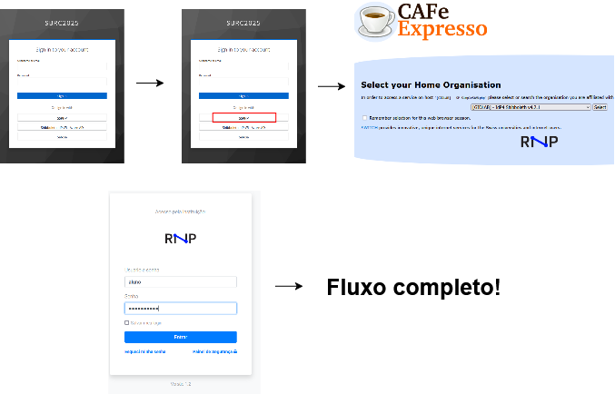

# Proxies em Ambientes de Gerenciamento de Identidades: Estudo de Casos e Avaliação Prática

Este repositório contém as documentações e orientações do ambiente de degustação e dos proxies mencionados no artigo **Proxies em Ambientes de Gerenciamento de Identidades: Estudo de Casos e Avaliação Prática**.  

## 🎯 Ambiente de Degustação

Para acessar o ambiente de degustação:

<!--1️⃣ Acesse: [🔗 keycloak.gidlab.rnp.br](https://keycloak.gidlab.rnp.br)

2️⃣ Clique em **"Administration Console"**

3️⃣ Insira as credenciais:

- **Usuário:** `admin`
- **Senha:** `gidlab`
  4️⃣ No canto superior esquerdo, troque o **REALM** de `master` para `SBRC2025`
  5️⃣ Vá até **Clients**
  6️⃣ Clique na **Home URL** da conta
  7️⃣ Clique em **Sign in** (canto superior direito)
  8️⃣ Escolha o proxy desejado em **"Or sign in with"**

**Contas para utilização dos IdP3 e IdP4**

- **Usuário:** `aluno`
- **Senha:** `aluno@idpNUMERO` -->
1️⃣ Acesse: [🔗 keycloak.gidlab.rnp.br/realms/SBRC2025/account/#/](https://keycloak.gidlab.rnp.br/realms/SBRC2025/account/#/)

2️⃣ No canto superior direito da página, clique em 'Sign in'

3️⃣ Escolha o proxy desejado em **"Or sign in with"**

3️⃣ Caso escolha o SATOSA ou o SSPHP, será redirecionado para um serviço de descoberta onde deverá escolher um IdP para autenticação. Os IdPs disponíveis para teste são: IdP3 e IdP4

**Contas para utilização do IdP3**

- **Usuário:** `aluno`
- **Senha:** `aluno@idp3

**Contas para utilização do IdP4**

- **Usuário:** `aluno`
- **Senha:** `aluno@idp4


**Conta para utilização do Entra ID**

* **Usuário:** alunos.gidlab@uemgoutlookcom.onmicrosoft.com
* **Senha:** Suku466662 

Exemplo de fluxo:



---

## PROXIES

### 🔹Shibboleth e Microsoft Entra ID

Para instalação siga os passos abaixo nesta ordem:   

1️⃣ [**Instalação do Shibboleth 5**](Instalação Shibboleth 5.md)  

2️⃣[**Configuração do Azure com Shibboleth 5**](Configuração do Azure com Shibboleth 5.md)

---

### 🔹 SimpleSAMLphp  

Para instalação:

1️⃣ Siga [**Guia de Instalação e Configuração do SimpleSAMLphp como proxy SAML**](Guia de Instalação e Configuração do SimpleSAMLphp como proxy SAML.md).   

2️⃣ Após a instalação, edite o arquivo:     

- `simplesamlphp-config/default-ssl.conf`

3️⃣ Crie o diretório **certs-apache** e faça o build do Docker:

```
docker build .
```

4️⃣ Suba o container com:

```
docker compose up
```

---

### 🔹SATOSA

Para instalação:

1️⃣ Siga [**Guia Instalação Satosa**](Guia Instalação Satosa.md).

2️⃣ Após a instalação, suba o Docker disponível em `satosa-docker/`.


## Keycloak

Para instalação:

1️⃣ Siga [**Guia Instalação Keycloak**](Guia Instalação Keycloak.md).