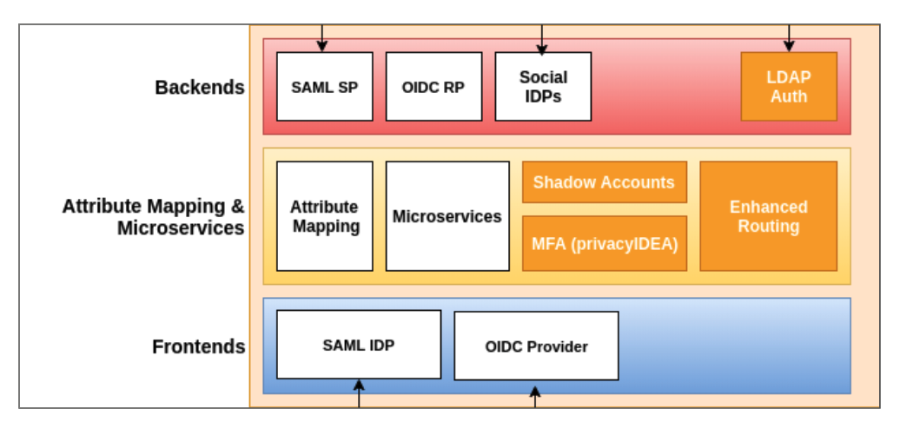

# SATOSA

## Características
   
   O `SATOSA` é uma solução de proxy, mantida pela organização [Identity Python](https://idpy.org/), para tradução e mapeamento de atributos entre os principais protocolos de autenticação, tais como: SAML2, OpenID Connect e OAuth2. Essas funcionalidades permitem a integração dos serviços com os mecanismos de autenticação sem a necessidade de implementação de todos os protocolos 
   
   Desenvolvido na linguagem Python, sua arquitetura foi projetada para ser modular com seus componentes implementados em forma de `plugins`, facilitando a adição de novas funcionalidades e/ou customização de recursos existentes. Além disso, toda a configuração é realizada através de arquivos `YAML`.
   
   A Figura a seguir, apresenta a arquitetura do `SATOSA` onde cada retângulo menor com fundo na cor branca representa um Plugin implementado por padrão. Os retângulos maiores, com fundos nas cores vermelha, amarela e azul, representam qual o tipo de Plugin e são divididos em `plugins` de `Backends`, `Frontends` e `Microservices`. 
   
   

## Plugins
   
   As principais funcionalidades e/ou recursos do `SATOSA` são implementados como Plugins e podem ser habilitados de acordo com a necessidade da instância. Como o objetivo da solução é de efetuar a tradução entre protocolos de autenticação, os plugins foram classificados de acordo com a finalidade na comunicação entre Serviços e os Mecanismos de Autenticação.
   
### Backends
  
Os Plugins de `Backends` são responsáveis pela comunicação entre o `SATOSA` e os mecanismos de autenticação. Mais precisamente, os `Backends` possuem a implementação do protocolo utilizado pelo mecanismo de autenticação que está em uso. O `SATOSA` possui alguns plugins deste tipo já implementado por padrão, dentre eles, o SAML, OIDC e OAuth.

O `Backend` para o protocolo SAML2 implementa as funcionalidades de um `SP` (Provedor de Serviço). O Plugin para o padrão OIDC age como um `RP` (Relying Party) e para o padrão OAuth tem um Plugin que implementa um `Client`.

### Frontends

Os Plugins de `Frontends` são responsáveis pela comunicação entre o `SATOSA` e Serviços. Possuem a implementação do protocolo de autenticação utilizado pelos Serviços. O `SATOSA` possui alguns plugins deste tipo já implementado por padrão, dentre eles, o SAML e OIDC.

O `Frontend` para o protocolo SAML2 implementa as funcionalidades de um `IdP` (Provedor de Identidade). Já o Plugin para o padrão OIDC age como um `OP` (OIDC Provider).

### Microservices

Os Plugins de `Microservices` são responsáveis pelo tratamento ou alteração das informações que são transferidas ou traduzidas entre os Plugins de `Backends` e `Frontends`. Possuem a implementação de mecanismos como: mapeamento de atributos, agregação de atributos, definição de rotas, entre outros. O `SATOSA` possui alguns plugins.
